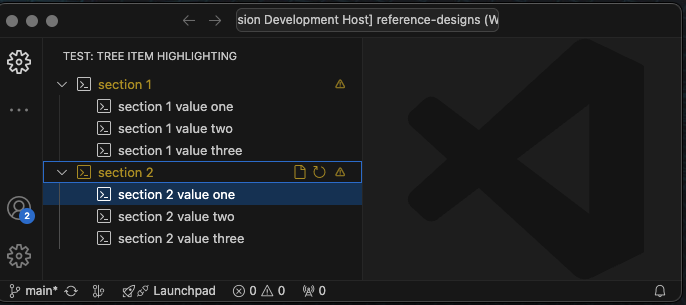

# README: tree-item-highlighting

TEST REPO - Not for any use, just used for testing.

This was created to help validate a bug in regards to vsce where tree item focus causes icons to change color. 

The thought being this will represetnt the issue outlined in issue [206056](https://github.com/microsoft/vscode/issues/206056).

# Instructions

1) open in vs code
2) run `npm install` in a terminal
3) click play in `Run and Debug` to run the `Launch Extension` [launch.json](.vscode/launch.json) config. 
4) change focus of the seclected element between tree-items and the section headers

# Result
The command icons show up on focus (as expected), but the `iconPath` for the header item changes color to that of the `DecorationProvider`. It seems like that `iconPath` should not change color. 

# Example

